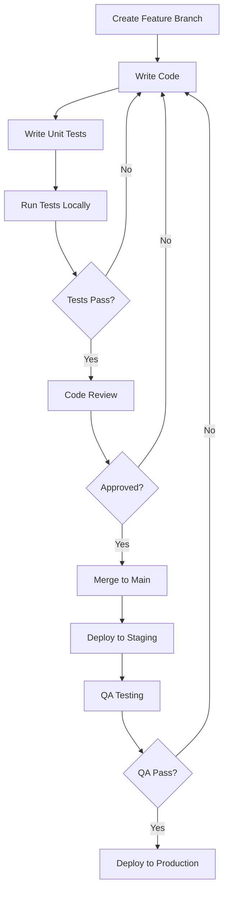

# Implementation Plan - Knowledge Management System

**Project:** Bajaringan AI Assistant - Knowledge Management
**Version:** 1.0.0
**Date:** 2025-12-21

---

## Table of Contents

1. [Project Overview](#1-project-overview)
2. [Implementation Phases](#2-implementation-phases)
3. [WordPress Plugin Development](#3-wordpress-plugin-development)
4. [Next.js Integration](#4-nextjs-integration)
5. [Testing Strategy](#5-testing-strategy)
6. [Deployment Plan](#6-deployment-plan)
7. [Maintenance & Support](#7-maintenance--support)

---

## 1. Project Overview

### 1.1 Objectives

Build a comprehensive Knowledge Management System for BARI AI Assistant that allows:

✅ Admin to manage knowledge base via WordPress CMS
✅ AI to fetch knowledge via REST API
✅ No query limits for any user type
✅ Analytics and insights for continuous improvement
✅ Seamless integration with existing Next.js AI system

### 1.2 Success Criteria

| Metric | Target |
|--------|--------|
| Admin can create/edit knowledge | < 2 minutes per entry |
| AI response latency | < 2 seconds (p95) |
| System uptime | > 99.5% |
| User satisfaction | > 85% positive |
| Knowledge accuracy | > 90% correct answers |

### 1.3 Timeline

| Phase | Duration | Target Date |
|-------|----------|-------------|
| Phase 1: WordPress Plugin Core | 2 weeks | Week 1-2 |
| Phase 2: Admin UI/UX | 2 weeks | Week 3-4 |
| Phase 3: API Development | 1 week | Week 5 |
| Phase 4: Next.js Integration | 1 week | Week 6 |
| Phase 5: Testing | 1 week | Week 7 |
| Phase 6: Deployment | 1 week | Week 8 |
| **Total** | **8 weeks** | **2 months** |

### 1.4 Team & Roles

| Role | Responsibilities | Resource |
|------|-----------------|----------|
| **Backend Developer** | WordPress plugin, database, API | 1 person |
| **Frontend Developer** | Admin UI/UX, React components | 1 person |
| **Full-Stack Developer** | Next.js integration, webhooks | 1 person |
| **QA Engineer** | Testing, bug reporting | 1 person |
| **DevOps** | Deployment, monitoring | 0.5 person |
| **Project Manager** | Coordination, timeline | 0.5 person |

---

## 2. Implementation Phases

### Phase 1: WordPress Plugin Core (Week 1-2)

**Goal:** Build foundational plugin structure and database

#### Tasks:

**Week 1:**
- [ ] Create plugin structure and files
- [ ] Implement database schema (all tables)
- [ ] Create activation/deactivation hooks
- [ ] Build BKM_Database class (CRUD operations)
- [ ] Implement role and capability system
- [ ] Write unit tests for database operations

**Week 2:**
- [ ] Build BKM_Core class (plugin initialization)
- [ ] Implement authentication system
- [ ] Create permission checking middleware
- [ ] Build versioning system
- [ ] Implement audit logging
- [ ] Write unit tests for core functionality

#### Deliverables:
- ✅ Plugin activates without errors
- ✅ All database tables created correctly
- ✅ Role-based access control working
- ✅ Version history tracking functional
- ✅ Unit tests passing (>80% coverage)

#### Dependencies:
- WordPress 6.0+ installed
- PostgreSQL 14+ with pgvector extension
- PHP 8.0+

---

### Phase 2: Admin UI/UX (Week 3-4)

**Goal:** Build complete admin interface for knowledge management

#### Tasks:

**Week 3:**
- [ ] Create dashboard page with statistics
- [ ] Build knowledge list view (table with filters)
- [ ] Implement search and filter functionality
- [ ] Create pagination
- [ ] Build category management UI
- [ ] Implement tag input component

**Week 4:**
- [ ] Build create/edit knowledge form
- [ ] Integrate WYSIWYG editor (WordPress native)
- [ ] Implement autosave functionality
- [ ] Build AI preview feature
- [ ] Create version history viewer
- [ ] Implement bulk operations UI
- [ ] Add import/export functionality
- [ ] Mobile responsive design

#### Deliverables:
- ✅ Fully functional admin panel
- ✅ WYSIWYG editor working
- ✅ AI preview functional
- ✅ Bulk operations working
- ✅ Mobile responsive
- ✅ User testing completed

#### Dependencies:
- Phase 1 completed
- Design system finalized
- WordPress editor library

---

### Phase 3: API Development (Week 5)

**Goal:** Build REST API for Next.js integration

#### Tasks:

- [ ] Create REST API namespace (`/wp-json/bari/v1/`)
- [ ] Implement knowledge endpoints:
  - [ ] GET `/knowledge` (list)
  - [ ] GET `/knowledge/search` (search)
  - [ ] GET `/knowledge/{id}` (single)
  - [ ] POST `/knowledge/{id}/track` (usage tracking)
  - [ ] POST `/knowledge/preview` (AI preview)
- [ ] Implement authentication endpoints:
  - [ ] POST `/auth/login` (JWT login)
  - [ ] POST `/auth/refresh` (refresh token)
  - [ ] POST `/auth/validate` (validate token)
- [ ] Implement analytics endpoints:
  - [ ] GET `/analytics/popular` (popular knowledge)
  - [ ] GET `/analytics/queries` (query stats)
- [ ] Build API key authentication system
- [ ] Implement rate limiting
- [ ] Add request validation and sanitization
- [ ] Write API documentation
- [ ] Create Postman collection for testing

#### Deliverables:
- ✅ All API endpoints functional
- ✅ Authentication working (JWT + API Key)
- ✅ Rate limiting implemented
- ✅ API documentation complete
- ✅ Postman collection available

#### Dependencies:
- Phase 1 completed
- SSL certificate configured
- API testing tools ready

---

### Phase 4: Next.js Integration (Week 6)

**Goal:** Integrate WordPress knowledge with Next.js AI system

#### Tasks:

- [ ] Create WordPress Knowledge Service (`src/services/wordpress-knowledge.service.ts`)
- [ ] Implement caching layer (5-minute TTL)
- [ ] Update query route to include WordPress search
- [ ] Implement usage tracking
- [ ] Create webhook handler for cache invalidation
- [ ] Update session storage (remove limits)
- [ ] Configure environment variables
- [ ] Test end-to-end flow
- [ ] Update TypeScript types
- [ ] Add error handling and logging

#### Deliverables:
- ✅ WordPress knowledge integrated in AI flow
- ✅ Caching working correctly
- ✅ Webhook clearing cache on update
- ✅ No query limits enforced
- ✅ End-to-end tests passing

#### Dependencies:
- Phase 3 completed
- Next.js environment configured
- API keys generated

---

### Phase 5: Testing (Week 7)

**Goal:** Comprehensive testing of entire system

#### Tasks:

**Unit Testing:**
- [ ] WordPress plugin unit tests (PHPUnit)
- [ ] Next.js service unit tests (Jest)
- [ ] Database operation tests
- [ ] API endpoint tests

**Integration Testing:**
- [ ] WordPress ↔ Database integration
- [ ] WordPress API ↔ Next.js integration
- [ ] Webhook integration
- [ ] Authentication flow testing

**E2E Testing:**
- [ ] Admin creates knowledge → AI uses it
- [ ] Guest user queries (unlimited)
- [ ] Logged-in user queries (unlimited)
- [ ] Cross-device history
- [ ] Analytics tracking

**Performance Testing:**
- [ ] Load testing (100 concurrent users)
- [ ] API response time (<500ms)
- [ ] Database query optimization
- [ ] Caching effectiveness

**Security Testing:**
- [ ] SQL injection testing
- [ ] XSS prevention testing
- [ ] CSRF protection testing
- [ ] API key security testing
- [ ] Rate limiting testing

**User Acceptance Testing:**
- [ ] Admin panel usability
- [ ] Knowledge creation workflow
- [ ] AI response accuracy
- [ ] Mobile responsiveness

#### Deliverables:
- ✅ All unit tests passing (>80% coverage)
- ✅ Integration tests passing
- ✅ E2E tests passing
- ✅ Performance benchmarks met
- ✅ Security vulnerabilities addressed
- ✅ UAT feedback incorporated

#### Dependencies:
- Phase 4 completed
- Testing environment set up
- Test data prepared

---

### Phase 6: Deployment (Week 8)

**Goal:** Deploy to production environment

#### Tasks:

**Pre-Deployment:**
- [ ] Backup production database
- [ ] Review environment variables
- [ ] SSL certificates verified
- [ ] DNS configuration checked
- [ ] Rollback plan prepared

**WordPress Deployment:**
- [ ] Upload plugin to production
- [ ] Activate plugin
- [ ] Verify database migration
- [ ] Configure plugin settings
- [ ] Generate API keys
- [ ] Set up webhook URL

**Next.js Deployment:**
- [ ] Build production bundle
- [ ] Deploy to hosting (Vercel/AWS/etc)
- [ ] Configure environment variables
- [ ] Verify API connectivity
- [ ] Test webhook endpoint

**Post-Deployment:**
- [ ] Smoke testing (critical paths)
- [ ] Monitor error logs
- [ ] Check analytics
- [ ] Performance monitoring
- [ ] User feedback collection

**Documentation:**
- [ ] Admin user guide
- [ ] API documentation
- [ ] Deployment runbook
- [ ] Troubleshooting guide

#### Deliverables:
- ✅ Production deployment successful
- ✅ All systems operational
- ✅ Monitoring in place
- ✅ Documentation complete
- ✅ Team trained

#### Dependencies:
- Phase 5 completed
- Production environment ready
- Stakeholder approval

---

## 3. WordPress Plugin Development

### 3.1 File Structure

```
bajaringan-knowledge-manager/
├── bajaringan-knowledge-manager.php     # Main plugin file
├── uninstall.php                        # Cleanup on uninstall
├── README.txt                           # WordPress plugin readme
├── LICENSE                              # GPL license
│
├── includes/                            # Core plugin logic
│   ├── class-bkm-core.php              # Core initialization
│   ├── class-bkm-database.php          # Database operations
│   ├── class-bkm-roles.php             # Roles & capabilities
│   ├── class-bkm-auth.php              # Authentication
│   ├── class-bkm-jwt-auth.php          # JWT token handling
│   ├── class-bkm-rest-api.php          # REST API endpoints
│   ├── class-bkm-sync.php              # Sync with Next.js
│   ├── class-bkm-admin.php             # Admin interface
│   ├── class-bkm-validator.php         # Input validation
│   ├── class-bkm-encryption.php        # Data encryption
│   └── class-bkm-audit-logger.php      # Audit logging
│
├── admin/                               # Admin interface
│   ├── views/
│   │   ├── dashboard.php               # Dashboard page
│   │   ├── knowledge-list.php          # List view
│   │   ├── knowledge-edit.php          # Create/Edit form
│   │   ├── settings.php                # Plugin settings
│   │   ├── api-keys.php                # API key management
│   │   └── analytics.php               # Analytics page
│   │
│   ├── css/
│   │   ├── bkm-admin.css               # Admin styles
│   │   └── bkm-mobile.css              # Mobile responsive
│   │
│   ├── js/
│   │   ├── bkm-admin.js                # Admin JavaScript
│   │   ├── bkm-editor.js               # Editor enhancements
│   │   ├── bkm-tags.js                 # Tag input component
│   │   └── bkm-preview.js              # AI preview
│   │
│   └── partials/                        # Reusable UI components
│       ├── header.php
│       ├── navigation.php
│       └── footer.php
│
├── assets/                              # Static assets
│   ├── icons/                          # UI icons
│   └── images/                         # Images
│
├── languages/                           # Translations
│   └── bajaringan-knowledge-manager.pot
│
└── tests/                               # Unit tests
    ├── test-database.php
    ├── test-roles.php
    ├── test-api.php
    └── bootstrap.php
```

### 3.2 Development Workflow



### 3.3 Coding Standards

**PHP:**
- Follow [WordPress Coding Standards](https://developer.wordpress.org/coding-standards/wordpress-coding-standards/php/)
- Use PHPCS for linting
- Document all functions with PHPDoc
- Use type hints (PHP 8.0+)

**JavaScript:**
- Follow WordPress JavaScript coding standards
- Use ESLint for linting
- Use modern ES6+ syntax
- Add JSDoc comments

**CSS:**
- Follow BEM naming convention
- Use CSS variables for theming
- Mobile-first approach
- Minimize specificity

### 3.4 Key Classes Implementation

#### BKM_Database Class

```php
<?php
class BKM_Database {
    private $wpdb;
    private $table_knowledge;
    private $table_categories;
    private $table_versions;

    public function __construct() {
        global $wpdb;
        $this->wpdb = $wpdb;
        $this->table_knowledge = $wpdb->prefix . 'bari_knowledge';
        $this->table_categories = $wpdb->prefix . 'bari_categories';
        $this->table_versions = $wpdb->prefix . 'bari_knowledge_versions';
    }

    /**
     * Create all database tables
     */
    public static function create_tables() {
        global $wpdb;
        $charset_collate = $wpdb->get_charset_collate();

        require_once(ABSPATH . 'wp-admin/includes/upgrade.php');

        // Knowledge table
        $sql_knowledge = "CREATE TABLE IF NOT EXISTS {$wpdb->prefix}bari_knowledge (
            id BIGINT(20) UNSIGNED NOT NULL AUTO_INCREMENT,
            title VARCHAR(500) NOT NULL,
            content LONGTEXT NOT NULL,
            category_id BIGINT(20) UNSIGNED,
            keywords TEXT,
            status VARCHAR(20) NOT NULL DEFAULT 'draft',
            requires_image TINYINT(1) NOT NULL DEFAULT 0,
            version INT NOT NULL DEFAULT 1,
            usage_count BIGINT NOT NULL DEFAULT 0,
            created_by BIGINT(20) UNSIGNED,
            updated_by BIGINT(20) UNSIGNED,
            created_at DATETIME NOT NULL DEFAULT CURRENT_TIMESTAMP,
            updated_at DATETIME NOT NULL DEFAULT CURRENT_TIMESTAMP ON UPDATE CURRENT_TIMESTAMP,
            PRIMARY KEY (id),
            FULLTEXT KEY idx_search (title, content),
            INDEX idx_status (status),
            INDEX idx_category (category_id)
        ) $charset_collate;";

        dbDelta($sql_knowledge);

        // Other tables...
    }

    /**
     * Get knowledge by ID
     */
    public function get_knowledge($id) {
        $query = $this->wpdb->prepare(
            "SELECT * FROM {$this->table_knowledge} WHERE id = %d",
            $id
        );

        return $this->wpdb->get_row($query);
    }

    /**
     * Search knowledge
     */
    public function search_knowledge($query, $limit = 5) {
        $search_query = $this->wpdb->prepare(
            "SELECT
                id,
                title,
                content,
                category_id,
                MATCH(title, content) AGAINST (%s IN NATURAL LANGUAGE MODE) AS relevance
            FROM {$this->table_knowledge}
            WHERE status = 'published'
              AND MATCH(title, content) AGAINST (%s IN NATURAL LANGUAGE MODE)
            ORDER BY relevance DESC
            LIMIT %d",
            $query,
            $query,
            $limit
        );

        return $this->wpdb->get_results($search_query);
    }

    /**
     * Create knowledge
     */
    public function create_knowledge($data) {
        $result = $this->wpdb->insert(
            $this->table_knowledge,
            array(
                'title' => $data['title'],
                'content' => $data['content'],
                'category_id' => $data['category_id'] ?? null,
                'keywords' => json_encode($data['keywords'] ?? []),
                'status' => $data['status'] ?? 'draft',
                'requires_image' => $data['requires_image'] ?? 0,
                'created_by' => get_current_user_id()
            ),
            array('%s', '%s', '%d', '%s', '%s', '%d', '%d')
        );

        if ($result === false) {
            return new WP_Error('db_error', 'Failed to create knowledge');
        }

        $knowledge_id = $this->wpdb->insert_id;

        // Create version snapshot
        $this->create_version_snapshot($knowledge_id, 1);

        return $knowledge_id;
    }

    /**
     * Update knowledge
     */
    public function update_knowledge($id, $data) {
        // Get current knowledge for comparison
        $current = $this->get_knowledge($id);
        if (!$current) {
            return new WP_Error('not_found', 'Knowledge not found');
        }

        // Update knowledge
        $result = $this->wpdb->update(
            $this->table_knowledge,
            array(
                'title' => $data['title'],
                'content' => $data['content'],
                'category_id' => $data['category_id'] ?? null,
                'keywords' => json_encode($data['keywords'] ?? []),
                'status' => $data['status'] ?? $current->status,
                'requires_image' => $data['requires_image'] ?? $current->requires_image,
                'version' => $current->version + 1,
                'updated_by' => get_current_user_id()
            ),
            array('id' => $id),
            array('%s', '%s', '%d', '%s', '%s', '%d', '%d', '%d'),
            array('%d')
        );

        if ($result === false) {
            return new WP_Error('db_error', 'Failed to update knowledge');
        }

        // Create version snapshot
        $this->create_version_snapshot($id, $current->version + 1);

        return true;
    }

    /**
     * Create version snapshot
     */
    private function create_version_snapshot($knowledge_id, $version) {
        $knowledge = $this->get_knowledge($knowledge_id);

        $this->wpdb->insert(
            $this->table_versions,
            array(
                'knowledge_id' => $knowledge_id,
                'version' => $version,
                'title' => $knowledge->title,
                'content' => $knowledge->content,
                'category_id' => $knowledge->category_id,
                'keywords' => $knowledge->keywords,
                'status' => $knowledge->status,
                'created_by' => get_current_user_id()
            ),
            array('%d', '%d', '%s', '%s', '%d', '%s', '%s', '%d')
        );
    }
}
```

---

## 4. Next.js Integration

### 4.1 File Structure

```
src/
├── services/
│   ├── wordpress-knowledge.service.ts   # WordPress API client
│   ├── qa-matcher.ts                    # Existing Q&A matcher
│   ├── intent-detector.ts               # Existing intent detector
│   └── intent-handlers.ts               # Existing intent handlers
│
├── types/
│   ├── wordpress-knowledge.ts           # WordPress types
│   └── memory.ts                        # Existing types
│
├── utils/
│   ├── session-storage.ts               # Session management (updated)
│   └── cache.ts                         # Cache utilities
│
└── app/
    └── api/
        ├── query/
        │   └── route.ts                 # Main query handler (updated)
        └── webhooks/
            └── knowledge-updated/
                └── route.ts              # Webhook handler
```

### 4.2 Environment Variables

```bash
# .env.local

# WordPress API Configuration
WORDPRESS_API_URL=https://your-wordpress-site.com
WORDPRESS_API_KEY=bari_sk_1a2b3c4d5e6f7g8h9i0j...

# Webhook Secret (must match WordPress setting)
WEBHOOK_SECRET=your-random-secret-string-min-32-chars

# Existing variables
DATABASE_URL=postgresql://...
GEMINI_API_KEY=...
NEXT_PUBLIC_API_URL=https://your-nextjs-app.com
```

### 4.3 Integration Points

#### Query Flow Integration

```typescript
// src/app/api/query/route.ts

export async function POST(request: NextRequest) {
  const startTime = Date.now();

  try {
    const { query, conversationHistory = [] } = await request.json();

    // ============================================
    // STEP 0: INTENT DETECTION
    // ============================================
    const intentResult = await detector.detectIntent(query, conversationHistory);

    // Handle specific intents (calculator, survey, etc)
    if (shouldHandleIntent) {
      return handleSpecificIntent(intentResult);
    }

    // ============================================
    // STEP 1: Q&A KNOWLEDGE MATCHING
    // ============================================
    const qaMatch = await matchQAKnowledge(query);
    if (qaMatch && qaMatch.confidence >= 0.7) {
      return returnQAAnswer(qaMatch);
    }

    // ============================================
    // STEP 2: WORDPRESS KNOWLEDGE SEARCH (NEW!)
    // ============================================
    console.log('🔍 Checking WordPress knowledge base...');
    const wpKnowledge = getWordPressKnowledgeService();
    const wpResults = await wpKnowledge.searchKnowledge(query, 3);

    if (wpResults.length > 0 && wpResults[0].relevance >= 0.8) {
      const topResult = wpResults[0];
      console.log(`✅ WordPress match: ${topResult.title}`);

      // Track usage
      await wpKnowledge.trackUsage(topResult.id, sessionId, userId, query);

      return NextResponse.json({
        answer: topResult.content,
        citations: [{
          source: 'wordpress_knowledge',
          title: topResult.title,
          category: topResult.category
        }],
        metadata: {
          source: 'wordpress_knowledge',
          knowledge_id: topResult.id,
          relevance: topResult.relevance,
          latency_ms: Date.now() - startTime
        }
      });
    }

    // ============================================
    // STEP 3: RAG WITH VECTOR SEARCH
    // ============================================
    console.log('📚 No WordPress match, proceeding with RAG...');

    // Existing RAG flow...
  }
}
```

### 4.4 Session Storage Update

```typescript
// src/utils/session-storage.ts

interface Message {
  role: 'user' | 'assistant';
  content: string;
  timestamp: number;
  citations?: any[];
}

interface GuestSession {
  sessionId: string;
  messages: Message[];
  createdAt: number;
  expiresAt: number;
}

export class SessionStorage {
  private static STORAGE_KEY = 'bari_chat_session';
  private static SESSION_DURATION = 7 * 24 * 60 * 60 * 1000; // 7 days

  static getSession(): GuestSession {
    const stored = localStorage.getItem(this.STORAGE_KEY);

    if (stored) {
      try {
        const session: GuestSession = JSON.parse(stored);

        // Check expiry
        if (Date.now() > session.expiresAt) {
          return this.createNewSession();
        }

        return session;
      } catch (error) {
        console.error('Failed to parse session', error);
        return this.createNewSession();
      }
    }

    return this.createNewSession();
  }

  private static createNewSession(): GuestSession {
    const now = Date.now();
    const session: GuestSession = {
      sessionId: `guest_${now}`,
      messages: [],
      createdAt: now,
      expiresAt: now + this.SESSION_DURATION
    };

    this.saveSession(session);
    return session;
  }

  static addMessage(
    role: 'user' | 'assistant',
    content: string,
    citations?: any[]
  ): void {
    const session = this.getSession();

    session.messages.push({
      role,
      content,
      timestamp: Date.now(),
      ...(citations && { citations })
    });

    // Keep only last 50 messages
    if (session.messages.length > 50) {
      session.messages = session.messages.slice(-50);
    }

    this.saveSession(session);
  }

  private static saveSession(session: GuestSession): void {
    try {
      localStorage.setItem(this.STORAGE_KEY, JSON.stringify(session));
    } catch (error) {
      console.error('Failed to save session', error);
    }
  }

  static clearSession(): void {
    localStorage.removeItem(this.STORAGE_KEY);
  }

  static getConversationHistory(): Message[] {
    const session = this.getSession();
    return session.messages.slice(-10);
  }
}
```

---

## 5. Testing Strategy

### 5.1 Test Pyramid

```
                    ┌──────────┐
                    │   E2E    │ 10%
                    │  Tests   │
                ┌───┴──────────┴───┐
                │   Integration    │ 30%
                │     Tests        │
            ┌───┴──────────────────┴───┐
            │      Unit Tests          │ 60%
            │                          │
            └──────────────────────────┘
```

### 5.2 Unit Tests

**WordPress Plugin (PHPUnit):**

```php
// tests/test-database.php
class BKM_Database_Test extends WP_UnitTestCase {
    private $db;

    public function setUp() {
        parent::setUp();
        $this->db = new BKM_Database();
    }

    public function test_create_knowledge() {
        $data = array(
            'title' => 'Test Knowledge',
            'content' => 'Test content',
            'status' => 'draft'
        );

        $id = $this->db->create_knowledge($data);

        $this->assertIsInt($id);
        $this->assertGreaterThan(0, $id);

        $knowledge = $this->db->get_knowledge($id);
        $this->assertEquals('Test Knowledge', $knowledge->title);
    }

    public function test_search_knowledge() {
        // Create test data
        $this->db->create_knowledge(array(
            'title' => 'Baja Ringan',
            'content' => 'Informasi tentang baja ringan',
            'status' => 'published'
        ));

        $results = $this->db->search_knowledge('baja ringan');

        $this->assertNotEmpty($results);
        $this->assertContains('Baja Ringan', $results[0]->title);
    }
}
```

**Next.js Services (Jest):**

```typescript
// src/services/__tests__/wordpress-knowledge.service.test.ts

import { WordPressKnowledgeService } from '../wordpress-knowledge.service';

describe('WordPressKnowledgeService', () => {
  let service: WordPressKnowledgeService;

  beforeEach(() => {
    service = new WordPressKnowledgeService();
  });

  test('should search knowledge', async () => {
    const results = await service.searchKnowledge('baja ringan', 5);

    expect(results).toBeDefined();
    expect(Array.isArray(results)).toBe(true);

    if (results.length > 0) {
      expect(results[0]).toHaveProperty('id');
      expect(results[0]).toHaveProperty('title');
      expect(results[0]).toHaveProperty('relevance');
    }
  });

  test('should cache search results', async () => {
    const query = 'test query';

    const result1 = await service.searchKnowledge(query);
    const result2 = await service.searchKnowledge(query);

    // Second call should be from cache (faster)
    expect(result1).toEqual(result2);
  });

  test('should track usage', async () => {
    await expect(
      service.trackUsage(1, 'session_123', null, 'test query')
    ).resolves.not.toThrow();
  });
});
```

### 5.3 Integration Tests

```typescript
// tests/integration/wordpress-nextjs.test.ts

describe('WordPress-Next.js Integration', () => {
  test('should fetch knowledge from WordPress API', async () => {
    const response = await fetch(
      `${process.env.WORDPRESS_API_URL}/wp-json/bari/v1/knowledge/search?q=test`,
      {
        headers: {
          'X-API-Key': process.env.WORDPRESS_API_KEY || ''
        }
      }
    );

    expect(response.ok).toBe(true);
    const data = await response.json();
    expect(data.success).toBe(true);
    expect(Array.isArray(data.data)).toBe(true);
  });

  test('should handle webhook cache invalidation', async () => {
    const response = await fetch(
      `${process.env.NEXT_PUBLIC_API_URL}/api/webhooks/knowledge-updated`,
      {
        method: 'POST',
        headers: {
          'Content-Type': 'application/json',
          'X-Webhook-Secret': process.env.WEBHOOK_SECRET || ''
        },
        body: JSON.stringify({
          event: 'knowledge.updated',
          data: { id: 1 }
        })
      }
    );

    expect(response.ok).toBe(true);
    const data = await response.json();
    expect(data.success).toBe(true);
  });
});
```

### 5.4 E2E Tests (Playwright)

```typescript
// tests/e2e/knowledge-management.spec.ts

import { test, expect } from '@playwright/test';

test.describe('Knowledge Management E2E', () => {
  test('admin can create and publish knowledge', async ({ page }) => {
    // Login to WordPress
    await page.goto('https://your-wp-site.com/wp-login.php');
    await page.fill('#user_login', 'admin');
    await page.fill('#user_pass', 'password');
    await page.click('#wp-submit');

    // Navigate to knowledge management
    await page.goto('https://your-wp-site.com/wp-admin/admin.php?page=bari-knowledge');

    // Create new knowledge
    await page.click('text=Add Knowledge');
    await page.fill('#title', 'Test Knowledge');
    await page.fill('#content', 'Test content for E2E testing');
    await page.selectOption('#category', '1');

    // Publish
    await page.click('text=Publish');

    // Verify success message
    await expect(page.locator('.notice-success')).toContainText('Knowledge published');
  });

  test('AI uses WordPress knowledge to answer user query', async ({ page }) => {
    // Open chatbot
    await page.goto('https://your-nextjs-app.com');

    // Send query
    await page.fill('[data-testid="chat-input"]', 'Test Knowledge');
    await page.click('[data-testid="send-button"]');

    // Wait for response
    await page.waitForSelector('[data-testid="assistant-message"]');

    // Verify response contains WordPress knowledge
    const response = await page.textContent('[data-testid="assistant-message"]');
    expect(response).toContain('Test content for E2E testing');
  });
});
```

### 5.5 Performance Tests

```javascript
// tests/performance/load-test.js
import http from 'k6/http';
import { check, sleep } from 'k6';

export let options = {
  stages: [
    { duration: '2m', target: 100 }, // Ramp up to 100 users
    { duration: '5m', target: 100 }, // Stay at 100 users
    { duration: '2m', target: 0 },   // Ramp down
  ],
  thresholds: {
    http_req_duration: ['p(95)<2000'], // 95% of requests must complete below 2s
    http_req_failed: ['rate<0.01'],    // Error rate must be below 1%
  },
};

export default function () {
  const payload = JSON.stringify({
    query: 'Bagaimana cara menghitung baja ringan?',
    stream: false
  });

  const params = {
    headers: {
      'Content-Type': 'application/json',
    },
  };

  let response = http.post(
    'https://your-nextjs-app.com/api/query',
    payload,
    params
  );

  check(response, {
    'status is 200': (r) => r.status === 200,
    'response time < 2s': (r) => r.timings.duration < 2000,
    'has answer': (r) => JSON.parse(r.body).answer !== undefined,
  });

  sleep(1);
}
```

---

## 6. Deployment Plan

### 6.1 Pre-Deployment Checklist

```
Infrastructure:
✅ Production server configured
✅ PostgreSQL 14+ with pgvector installed
✅ SSL certificates installed and valid
✅ DNS records configured
✅ Firewall rules configured
✅ Backup system in place

WordPress:
✅ WordPress 6.0+ installed
✅ PHP 8.0+ installed
✅ Required PHP extensions enabled (pdo, pdo_pgsql, openssl, json)
✅ wp-config.php configured correctly
✅ File permissions set correctly (755 directories, 644 files)
✅ Database connection verified

Next.js:
✅ Node.js 18+ installed
✅ Environment variables configured
✅ Build successful locally
✅ API endpoints tested
✅ Database migrations run

Security:
✅ Security headers configured
✅ HTTPS enforced
✅ API keys generated
✅ Webhook secrets set
✅ Rate limiting configured

Documentation:
✅ Deployment runbook prepared
✅ Rollback plan documented
✅ Admin user guide ready
✅ API documentation complete
```

### 6.2 Deployment Steps

#### WordPress Plugin Deployment

```bash
# Step 1: Backup production database
wp db export backup-$(date +%Y%m%d-%H%M%S).sql

# Step 2: Upload plugin
# Via SFTP or:
rsync -avz --progress \
  ./bajaringan-knowledge-manager/ \
  user@server:/var/www/html/wp-content/plugins/bajaringan-knowledge-manager/

# Step 3: Set permissions
ssh user@server << 'EOF'
cd /var/www/html/wp-content/plugins/bajaringan-knowledge-manager
find . -type d -exec chmod 755 {} \;
find . -type f -exec chmod 644 {} \;
EOF

# Step 4: Activate plugin
wp plugin activate bajaringan-knowledge-manager

# Step 5: Verify database tables
wp db query "SHOW TABLES LIKE 'wp_bari_%';"

# Step 6: Configure plugin settings
# Via WordPress admin panel
```

#### Next.js Deployment (Vercel)

```bash
# Step 1: Install Vercel CLI
npm install -g vercel

# Step 2: Build and deploy
vercel --prod

# Step 3: Set environment variables
vercel env add WORDPRESS_API_URL production
vercel env add WORDPRESS_API_KEY production
vercel env add WEBHOOK_SECRET production

# Step 4: Redeploy with environment variables
vercel --prod

# Step 5: Verify deployment
curl https://your-nextjs-app.com/api/query \
  -X POST \
  -H "Content-Type: application/json" \
  -d '{"query": "test", "stream": false}'
```

#### Next.js Deployment (Self-Hosted)

```bash
# Step 1: Build production bundle
npm run build

# Step 2: Upload to server
rsync -avz --progress \
  ./.next/ \
  user@server:/var/www/nextjs/.next/

rsync -avz --progress \
  ./public/ \
  user@server:/var/www/nextjs/public/

# Step 3: Install dependencies on server
ssh user@server << 'EOF'
cd /var/www/nextjs
npm ci --production
EOF

# Step 4: Set environment variables
ssh user@server << 'EOF'
cat > /var/www/nextjs/.env.production << 'ENVEOF'
WORDPRESS_API_URL=https://your-wp-site.com
WORDPRESS_API_KEY=bari_sk_...
WEBHOOK_SECRET=...
DATABASE_URL=postgresql://...
GEMINI_API_KEY=...
ENVEOF
EOF

# Step 5: Restart Next.js process (PM2)
ssh user@server << 'EOF'
pm2 restart nextjs
pm2 save
EOF

# Step 6: Verify deployment
curl https://your-nextjs-app.com/api/query \
  -X POST \
  -H "Content-Type: application/json" \
  -d '{"query": "test", "stream": false}'
```

### 6.3 Post-Deployment Verification

```bash
# Test WordPress API
curl -H "X-API-Key: $WORDPRESS_API_KEY" \
  https://your-wp-site.com/wp-json/bari/v1/knowledge

# Test Next.js integration
curl -X POST \
  -H "Content-Type: application/json" \
  -d '{"query": "cara hitung baja ringan", "stream": false}' \
  https://your-nextjs-app.com/api/query

# Test webhook
curl -X POST \
  -H "Content-Type: application/json" \
  -H "X-Webhook-Secret: $WEBHOOK_SECRET" \
  -d '{"event": "knowledge.updated", "data": {"id": 1}}' \
  https://your-nextjs-app.com/api/webhooks/knowledge-updated

# Check error logs
# WordPress
tail -f /var/log/php-fpm/error.log

# Next.js
pm2 logs nextjs
```

### 6.4 Rollback Plan

```bash
# WordPress Plugin Rollback

# Step 1: Deactivate plugin
wp plugin deactivate bajaringan-knowledge-manager

# Step 2: Restore database backup
wp db import backup-YYYYMMDD-HHMMSS.sql

# Step 3: Remove plugin files
rm -rf /var/www/html/wp-content/plugins/bajaringan-knowledge-manager

# Next.js Rollback (Vercel)

# Step 1: View deployments
vercel list

# Step 2: Promote previous deployment
vercel promote <previous-deployment-url>

# Next.js Rollback (Self-Hosted)

# Step 1: Checkout previous version
git checkout <previous-commit-hash>

# Step 2: Rebuild
npm run build

# Step 3: Restart
pm2 restart nextjs
```

### 6.5 Monitoring Setup

```yaml
# monitoring/alerts.yaml

# WordPress API Health
- name: WordPress API Health Check
  type: http
  url: https://your-wp-site.com/wp-json/bari/v1/knowledge
  method: GET
  headers:
    X-API-Key: $WORDPRESS_API_KEY
  interval: 60s
  timeout: 10s
  success_criteria:
    - status_code: 200
    - response_time_ms < 500
  alerts:
    - type: email
      recipients: [ops@bajaringan.com]
    - type: slack
      channel: #alerts

# Next.js API Health
- name: Next.js Query API
  type: http
  url: https://your-nextjs-app.com/api/query
  method: POST
  body: '{"query": "test", "stream": false}'
  headers:
    Content-Type: application/json
  interval: 60s
  timeout: 10s
  success_criteria:
    - status_code: 200
    - response_time_ms < 2000
  alerts:
    - type: email
      recipients: [ops@bajaringan.com]

# Database Connection
- name: PostgreSQL Connection
  type: database
  connection_string: $DATABASE_URL
  query: "SELECT 1"
  interval: 300s
  alerts:
    - type: pagerduty
      severity: critical
```

---

## 7. Maintenance & Support

### 7.1 Regular Maintenance Tasks

#### Daily:
- [ ] Monitor error logs (WordPress, Next.js, database)
- [ ] Check system health dashboards
- [ ] Review API response times
- [ ] Monitor disk space usage

#### Weekly:
- [ ] Review analytics (popular knowledge, query patterns)
- [ ] Check for WordPress/plugin updates
- [ ] Review and address user feedback
- [ ] Optimize slow database queries

#### Monthly:
- [ ] Database backup verification (restore test)
- [ ] Security audit (check for vulnerabilities)
- [ ] Performance optimization review
- [ ] Update documentation if needed
- [ ] Review and clean up old data

#### Quarterly:
- [ ] Comprehensive security review
- [ ] Disaster recovery drill
- [ ] Capacity planning review
- [ ] User satisfaction survey

### 7.2 Troubleshooting Guide

#### Issue: WordPress API returns 500 error

**Diagnosis:**
```bash
# Check PHP error logs
tail -f /var/log/php-fpm/error.log

# Check WordPress debug log
tail -f /var/www/html/wp-content/debug.log

# Check database connection
wp db check
```

**Common Causes:**
- Database connection failed
- PHP memory limit exceeded
- Plugin conflict

**Solution:**
```bash
# Increase PHP memory limit (wp-config.php)
define('WP_MEMORY_LIMIT', '256M');

# Test database connection
wp db query "SELECT 1"

# Deactivate other plugins temporarily
wp plugin deactivate --all
wp plugin activate bajaringan-knowledge-manager
```

#### Issue: Next.js API slow responses

**Diagnosis:**
```bash
# Check response times
time curl -X POST \
  -H "Content-Type: application/json" \
  -d '{"query": "test"}' \
  https://your-nextjs-app.com/api/query

# Check database query performance
EXPLAIN ANALYZE SELECT ...

# Check cache hit rate
# Monitor cache statistics
```

**Common Causes:**
- Database query not optimized
- Cache not working
- WordPress API slow

**Solution:**
```bash
# Add database indexes
CREATE INDEX idx_usage ON wp_bari_knowledge(usage_count DESC);

# Clear cache and warm up
# In Next.js
wpKnowledge.clearCache();

# Optimize PostgreSQL
VACUUM ANALYZE wp_bari_knowledge;
```

#### Issue: Webhook not firing

**Diagnosis:**
```bash
# Check WordPress webhook logs
wp bari webhook logs

# Check Next.js webhook endpoint
curl -X POST \
  -H "X-Webhook-Secret: $WEBHOOK_SECRET" \
  -d '{"event": "test"}' \
  https://your-nextjs-app.com/api/webhooks/knowledge-updated

# Check network connectivity
ping your-nextjs-app.com
```

**Common Causes:**
- Webhook URL incorrect
- Secret mismatch
- Firewall blocking requests

**Solution:**
```bash
# Verify webhook URL in WordPress settings
wp option get bkm_nextjs_webhook_url

# Verify secret matches
echo $WEBHOOK_SECRET

# Test webhook manually
wp bari webhook trigger knowledge.updated 1
```

### 7.3 Support Contacts

| Issue Type | Contact | Response Time |
|------------|---------|---------------|
| **Critical (System Down)** | ops@bajaringan.com<br>+62 812-3456-7890 | 15 minutes |
| **High (Performance)** | support@bajaringan.com | 2 hours |
| **Medium (Bug)** | support@bajaringan.com | 1 business day |
| **Low (Feature Request)** | product@bajaringan.com | 1 week |

### 7.4 Backup & Recovery

#### Backup Schedule:

```bash
# Daily automated backup (3 AM)
0 3 * * * /usr/local/bin/backup-wordpress.sh
0 3 * * * /usr/local/bin/backup-nextjs-db.sh

# Weekly full backup (Sunday 2 AM)
0 2 * * 0 /usr/local/bin/backup-full.sh

# Retention:
# - Daily backups: 7 days
# - Weekly backups: 4 weeks
# - Monthly backups: 12 months
```

#### Backup Script Example:

```bash
#!/bin/bash
# backup-wordpress.sh

DATE=$(date +%Y%m%d-%H%M%S)
BACKUP_DIR="/backups/wordpress"
WP_DIR="/var/www/html"

# Create backup directory
mkdir -p $BACKUP_DIR

# Backup database
wp db export $BACKUP_DIR/db-$DATE.sql

# Backup files
tar -czf $BACKUP_DIR/files-$DATE.tar.gz \
  $WP_DIR/wp-content/plugins/bajaringan-knowledge-manager \
  $WP_DIR/wp-content/uploads

# Upload to cloud storage (AWS S3)
aws s3 cp $BACKUP_DIR/db-$DATE.sql s3://bajaringan-backups/wordpress/
aws s3 cp $BACKUP_DIR/files-$DATE.tar.gz s3://bajaringan-backups/wordpress/

# Remove local backups older than 7 days
find $BACKUP_DIR -name "*.sql" -mtime +7 -delete
find $BACKUP_DIR -name "*.tar.gz" -mtime +7 -delete

echo "Backup completed: $DATE"
```

#### Recovery Procedure:

```bash
# Step 1: List available backups
aws s3 ls s3://bajaringan-backups/wordpress/

# Step 2: Download backup
aws s3 cp s3://bajaringan-backups/wordpress/db-20251221-030000.sql .
aws s3 cp s3://bajaringan-backups/wordpress/files-20251221-030000.tar.gz .

# Step 3: Restore database
wp db import db-20251221-030000.sql

# Step 4: Restore files
tar -xzf files-20251221-030000.tar.gz -C /var/www/html/

# Step 5: Verify
wp db check
wp plugin list
```

---

## Appendix

### A. Development Environment Setup

```bash
# Install WordPress locally (using Local by Flywheel or Docker)

# Docker Compose for local development
version: '3'
services:
  wordpress:
    image: wordpress:latest
    ports:
      - "8080:80"
    environment:
      WORDPRESS_DB_HOST: db
      WORDPRESS_DB_USER: wordpress
      WORDPRESS_DB_PASSWORD: wordpress
      WORDPRESS_DB_NAME: wordpress
    volumes:
      - ./bajaringan-knowledge-manager:/var/www/html/wp-content/plugins/bajaringan-knowledge-manager

  db:
    image: postgres:14
    environment:
      POSTGRES_DB: wordpress
      POSTGRES_USER: wordpress
      POSTGRES_PASSWORD: wordpress
    volumes:
      - db_data:/var/lib/postgresql/data

  nextjs:
    build: .
    ports:
      - "3000:3000"
    environment:
      WORDPRESS_API_URL: http://wordpress
      DATABASE_URL: postgresql://wordpress:wordpress@db/wordpress

volumes:
  db_data:
```

### B. Useful Commands

```bash
# WordPress CLI
wp plugin list                          # List all plugins
wp plugin activate bkm                  # Activate plugin
wp db query "SELECT * FROM wp_bari_knowledge LIMIT 5"
wp cache flush                          # Clear cache
wp bari knowledge list                  # Custom command (if implemented)

# Next.js
npm run dev                             # Start dev server
npm run build                           # Build for production
npm run start                           # Start production server
npm run lint                            # Lint code
npm test                                # Run tests

# Database
psql $DATABASE_URL -c "SELECT COUNT(*) FROM wp_bari_knowledge"
pg_dump $DATABASE_URL > backup.sql      # Backup
psql $DATABASE_URL < backup.sql         # Restore

# Git
git checkout -b feature/new-feature     # Create feature branch
git commit -m "feat: add feature"       # Commit
git push origin feature/new-feature     # Push to remote
```

### C. Code Review Checklist

```
WordPress Plugin:
✅ Follows WordPress coding standards
✅ All inputs sanitized and validated
✅ All outputs escaped
✅ No SQL injection vulnerabilities
✅ CSRF protection implemented
✅ Capability checks in place
✅ PHPDoc comments complete
✅ Unit tests written
✅ No PHP warnings/errors

Next.js:
✅ TypeScript types defined
✅ Error handling implemented
✅ No console.log in production
✅ Environment variables used correctly
✅ API responses validated
✅ Unit tests written
✅ No ESLint warnings

General:
✅ Code follows DRY principle
✅ Functions are small and focused
✅ Variable names are descriptive
✅ No hardcoded values
✅ Documentation updated
✅ Performance considered
```

---

**Document Version:** 1.0.0
**Last Updated:** 2025-12-21
**Project Manager:** [Name]
**Technical Lead:** [Name]

---

© 2025 Bajaringan. All rights reserved.
